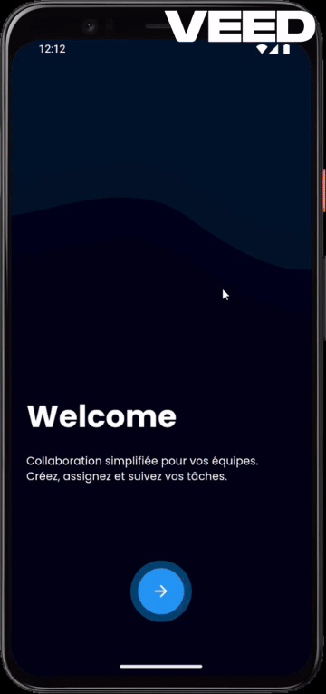

# 📱 First App - Task Management Application

<div align="center">


**Collaboration simplifiée pour vos équipes**  
Créez, assignez et suivez vos tâches efficacement

[](https://flutter.dev)
[](https://dart.dev)
[](https://firebase.google.com)
[]()

</div>

---

## 🎬 Démonstration

<div align="center">
  
</div>

---

## ✨ Fonctionnalités

### 🔐 Authentification Complète
- ✅ **Inscription traditionnelle** avec validation complète des données
- ✅ **Connexion sécurisée** avec hashage des mots de passe (SHA-256)
- ✅ **Google Sign-In** 🆕 - Connexion rapide avec votre compte Google
- ✅ **Firebase Authentication** 🆕 - Backend d'authentification sécurisé
- ✅ Gestion de session utilisateur persistante
- ✅ Option "Se souvenir de moi"
- ✅ Stockage hybride : Local (Hive) + Cloud (Firebase)

### 📊 Gestion des Tâches
- 📝 Création et suivi des tâches
- 🎯 Système de priorités (Haute, Moyenne, Basse)
- 📅 Dates d'échéance avec rappels visuels
- ✅ Marquage des tâches terminées
- 📈 Statistiques en temps réel
- 🔄 Synchronisation cloud (préparé pour Firebase) 🆕
- 👥 Partage de tâches (architecture prête) 🆕

### 👤 Profil Utilisateur
- 👤 Gestion complète du profil personnel
- 🔔 Paramètres de notifications
- 🔒 Options de sécurité
- 🌙 Mode sombre / clair avec persistance
- 🔄 Synchronisation des préférences
- 📊 Statistiques personnelles

### 🎨 Interface Utilisateur
- 💫 Animations fluides et élégantes
- 🎨 Design moderne Material Design 3
- 📱 Interface responsive adaptative
- 🌗 Support complet du thème clair et sombre
- 🎭 Transitions de page personnalisées
- ⚡ Performance optimisée

---

## 🛠️ Technologies Utilisées

### Frontend
| Technologie | Description | Version |
|------------|-------------|---------|
| **Flutter** | Framework UI multi-plateforme | 3.9.2 |
| **Dart** | Langage de programmation | 3.9.2 |
| **Provider** | State Management | 6.0.5 |
| **GetX** | Navigation & State | 4.6.5 |

### Backend & Base de données
| Technologie | Description | Utilisation |
|------------|-------------|-------------|
| **Firebase Core** 🆕 | Plateforme Backend | Configuration |
| **Firebase Auth** 🆕 | Authentification | Google Sign-In |
| **Hive** | Base de données NoSQL locale | Stockage principal |
| **Hive Flutter** | Intégration Hive | Persistance |

### Authentification & Sécurité
| Technologie | Description | Usage |
|------------|-------------|-------|
| **Google Sign-In** 🆕 | OAuth 2.0 Google | Connexion sociale |
| **Firebase Authentication** 🆕 | Service d'auth | Backend auth |
| **Crypto** | Hashage SHA-256 | Sécurité mots de passe |

### UI & Animations
| Technologie | Description |
|------------|-------------|
| **Iconsax** | Bibliothèque d'icônes moderne |
| **Simple Animations** | Animations personnalisées |
| **Page Transition** | Transitions de page |

---

## 📦 Dépendances Principales

```yaml
dependencies:
  flutter:
    sdk: flutter
  
  # State Management & Navigation
  provider: ^6.0.5
  get: ^4.6.5
  
  # Base de données
  hive: ^2.2.3
  hive_flutter: ^1.1.0
  get_storage: ^2.0.5
  
  # Firebase & Authentication 🆕
  firebase_core: ^2.5.0
  firebase_auth: ^4.16.0
  google_sign_in: ^6.2.1
  
  # Sécurité
  crypto: ^3.0.3
  
  # UI & Icons
  iconsax: ^0.0.8
  simple_animations: ^5.2.0
  page_transition: ^2.0.9
  
  # Utilitaires
  intl: ^0.18.0
  logger: ^2.0.0
```

---

## 🚀 Installation

### Prérequis
- Flutter SDK (≥3.9.2)
- Dart SDK (≥3.9.2)
- Android Studio / VS Code
- Git
- Compte Firebase (gratuit) 🆕
- Compte Google Cloud Console (pour Google Sign-In) 🆕

### Étapes d'installation

1. **Cloner le repository**
```bash
git clone <your-repository-url>
cd first_app
```

2. **Installer les dépendances**
```bash
flutter pub get
```

3. **Configurer Firebase** 🆕
```bash
# Installer Firebase CLI
npm install -g firebase-tools

# Se connecter à Firebase
firebase login

# Initialiser Firebase dans le projet
flutterfire configure
```

4. **Configurer Google Sign-In** 🆕

**Pour Android :**
```bash
# Obtenir le SHA-1
cd android
./gradlew signingReport

# Copier le SHA-1 et l'ajouter dans :
# Firebase Console > Project Settings > Your apps > Android app
```

**Pour iOS :**
- Télécharger `GoogleService-Info.plist` depuis Firebase
- Ajouter le fichier dans `ios/Runner/`
- Mettre à jour `ios/Runner/Info.plist` avec le REVERSED_CLIENT_ID

5. **Générer les fichiers Hive**
```bash
flutter packages pub run build_runner build
```

6. **Lancer l'application**
```bash
flutter run
```

---

## 📁 Structure du Projet

```
lib/
├── animation/              # Animations personnalisées
│   └── FadeAnimation.dart
├── common/                 # Widgets réutilisables
│   ├── style/
│   │   └── spacing_styles.dart
│   └── widgets/
│       └── login_signup/
│           ├── form_devider.dart
│           └── social_button.dart     # 🆕 Bouton Google Sign-In
├── models/                 # Modèles de données
│   ├── user_model.dart
│   └── user_model.g.dart
├── providers/              # State Management
│   ├── auth_provider.dart              # 🆕 Mis à jour avec Google Sign-In
│   ├── task_provider.dart
│   └── theme_provider.dart
├── screen/                 # Écrans de l'application
│   ├── Auth/
│   │   ├── login_page.dart
│   │   └── signup_page.dart
│   ├── Home/
│   │   └── HomeScreen.dart
│   ├── NavigationMenu.dart
│   ├── TasksScreen.dart
│   ├── NotificationsScreen.dart
│   └── ProfileScreen.dart
├── services/               # Services métier
│   ├── auth_service.dart
│   └── google_signin_service.dart      # 🆕 Service Google Sign-In
├── utils/                  # Utilitaires
│   ├── constants/
│   │   ├── colors.dart
│   │   ├── enums.dart
│   │   ├── image_strings.dart
│   │   ├── sizes.dart
│   │   └── text_strings.dart
│   ├── device/
│   │   └── device_utility.dart
│   ├── formatters/
│   │   └── formatter.dart
│   ├── helpers/
│   │   └── helper_functions.dart
│   ├── local_storage/
│   │   └── local_storage.dart
│   ├── logging/
│   │   └── logger.dart
│   ├── theme/
│   │   ├── theme.dart
│   │   └── customs_themes/
│   └── validators/
│       └── validator.dart
├── firebase_options.dart   # 🆕 Configuration Firebase
└── main.dart              # 🆕 Mis à jour avec Firebase
```

---

## 🎨 Thèmes et Design

### Palette de Couleurs

| Couleur | Light | Dark | Usage |
|---------|-------|------|-------|
| Primary | `#4b68ff` | `#4b68ff` | Actions principales |
| Secondary | `#FFE24B` | `#FFE24B` | Éléments secondaires |
| Accent | `#b0c7ff` | `#b0c7ff` | Accents |
| Background | `#FFFFFF` | `#000000` | Arrière-plan |
| Surface | `#F6F6F6` | `#272727` | Surfaces |

### Typographie
- **Police principale**: Poppins
- **Tailles**: Small (14px), Medium (16px), Large (18px)
- **Poids**: Light (300), Regular (400), Medium (500), SemiBold (600), Bold (800)

---

## 🔒 Sécurité

### Authentification
- ✅ **Hashage SHA-256** pour les mots de passe locaux
- ✅ **Firebase Authentication** pour l'authentification cloud 🆕
- ✅ **OAuth 2.0** via Google Sign-In 🆕
- ✅ **Token JWT** (préparé pour API backend) 🆕
- ✅ Validation stricte des entrées utilisateur
- ✅ Stockage sécurisé avec Hive (encrypted box ready)

### Protection des données
- ✅ Gestion des sessions
- ✅ Protection contre les injections
- ✅ Validation côté client et serveur (préparé)
- ✅ HTTPS pour toutes les communications Firebase

---

## 🏗️ Architecture

### Architecture Actuelle
```
┌─────────────────────────────────────┐
│         Flutter UI (Provider)        │
├─────────────────────────────────────┤
│     Authentication Layer             │
│  - Email/Password (Hive)             │
│  - Google Sign-In (Firebase) 🆕      │
├─────────────────────────────────────┤
│     Data Layer                       │
│  - Local: Hive Database              │
│  - Cloud: Firebase Auth 🆕           │
├─────────────────────────────────────┤
│     Business Logic                   │
│  - Providers (State Management)      │
│  - Services                          │
└─────────────────────────────────────┘
```

### Architecture Future (Prête pour migration) 🆕
```
┌─────────────────────────────────────┐
│         Flutter UI (Provider)        │
├─────────────────────────────────────┤
│     API Service Layer                │
│  - HTTP Client                       │
│  - Authentication (JWT)              │
├─────────────────────────────────────┤
│     Backend API                      │
│  - Node.js / Firebase Functions      │
│  - RESTful Endpoints                 │
├─────────────────────────────────────┤
│     Database                         │
│  - Firestore / MongoDB               │
└─────────────────────────────────────┘
```

---

## 🆕 Nouveautés de cette version

### Version 2.0.0 - Google Sign-In & Firebase

#### 🔐 Authentification améliorée
- ✅ **Google Sign-In** implémenté avec succès
- ✅ **Firebase Authentication** intégré
- ✅ Connexion sociale en un clic
- ✅ Gestion hybride : Local + Cloud
- ✅ Support multi-plateformes (Android, iOS, Web)

#### ☁️ Infrastructure Cloud
- ✅ **Firebase Core** configuré
- ✅ Configuration multi-plateformes
- ✅ Préparation pour Firestore
- ✅ Architecture scalable

#### 🔧 Services ajoutés
- ✅ `GoogleSignInService` - Gestion complète Google OAuth
- ✅ `FirebaseApiService` - Prêt pour Firestore (code disponible)
- ✅ `ApiService` - Prêt pour backend personnalisé (code disponible)

#### 📱 UI/UX améliorée
- ✅ Bouton Google Sign-In stylisé
- ✅ Loading states pour authentification
- ✅ Gestion des erreurs améliorée
- ✅ Feedback utilisateur optimisé

---

## 🎯 Roadmap

### ✅ Phase 1 : Authentification (TERMINÉ)
- [x] Authentification email/password
- [x] Google Sign-In
- [x] Firebase Authentication
- [x] Gestion des sessions

### 🚧 Phase 2 : Backend API (EN PRÉPARATION)
- [ ] Migration vers Firebase Firestore
- [ ] Synchronisation cloud des tâches
- [ ] Backup automatique
- [ ] API REST pour mobile

### 📅 Phase 3 : Collaboration (PLANIFIÉ)
- [ ] Partage de tâches entre utilisateurs
- [ ] Équipes et organisations
- [ ] Permissions et rôles
- [ ] Notifications push

### 🚀 Phase 4 : Fonctionnalités avancées (FUTUR)
- [ ] Mode hors ligne avec sync
- [ ] Pièces jointes aux tâches
- [ ] Rappels et notifications
- [ ] Analytics et rapports
- [ ] Export de données

---

## 📚 Documentation API

### Service Google Sign-In 🆕

```dart
final googleService = GoogleSignInService();

// Se connecter avec Google
final result = await googleService.signInWithGoogle();

if (result['success']) {
  final user = result['user'];
  print('Bienvenue ${user.firstName}');
}

// Se déconnecter
await googleService.signOutGoogle();

// Vérifier l'état de connexion
final isSignedIn = await googleService.isSignedInWithGoogle();
```

### Service Firebase API (Prêt pour implémentation) 🆕

```dart
final firebaseApi = FirebaseApiService();

// Sauvegarder un utilisateur
await firebaseApi.saveUser(userModel);

// Créer une tâche
await firebaseApi.createTask(userId, task);

// Écouter les changements en temps réel
firebaseApi.watchUserTasks(userId).listen((tasks) {
  // Mise à jour automatique de l'UI
});
```

---

## 🤝 Contribution

Les contributions sont les bienvenues ! Pour contribuer :

1. Fork le projet
2. Créer une branche (`git checkout -b feature/AmazingFeature`)
3. Commit vos changements (`git commit -m 'Add some AmazingFeature'`)
4. Push vers la branche (`git push origin feature/AmazingFeature`)
5. Ouvrir une Pull Request

### Guidelines de contribution
- Suivre les conventions de code Dart
- Ajouter des tests pour les nouvelles fonctionnalités
- Mettre à jour la documentation
- Respecter l'architecture existante

---

## 🐛 Problèmes connus

### Android
- Google Sign-In nécessite le SHA-1 correct dans Firebase Console
- Émulateur doit avoir Google Play Services installé

### iOS
- REVERSED_CLIENT_ID doit être correctement configuré dans Info.plist
- Simulateur peut nécessiter un compte Google de test

### Solutions
Consultez notre [Wiki](wiki-url) pour les solutions détaillées.

---

## 📄 License

Ce projet est privé et non destiné à la publication publique.

---

## 👨‍💻 Auteur

- GitHub: [@Hvmzvbe](https://github.com/Hvmzvbe)
- Email: hamzabeng64@gmail.com

---

## 🙏 Remerciements

- Flutter Team pour le framework incroyable
- Firebase pour l'infrastructure backend
- Google pour les services d'authentification
- La communauté open-source Flutter

---

## 📞 Support

Pour obtenir de l'aide :
- 📧 Email: hamzabeng64@gmail.com
- 🐛 Issues: [GitHub Issues](github-issues-url)
- 📖 Documentation: [Wiki](wiki-url)

---

<div align="center">
  
### ⭐ Si vous aimez ce projet, donnez-lui une étoile !

<p>Fait avec ❤️ en Flutter</p>


**Version 2.0.0** - Dernière mise à jour: Décembre 2024

</div>